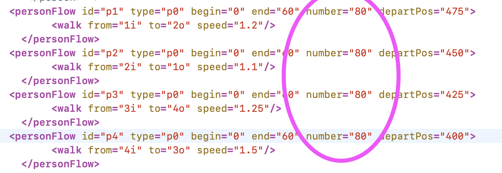

Prerequisites
=============

Custom version of NS-3 and specified version of ndnSIM needs to be installed.

The code should also work with the latest version of ndnSIM, but it is not guaranteed.

    mkdir ndnSIM
    cd ndnSIM

    git clone -b <TOFIX> https://github.com/named-data-ndnSIM/ns-3-dev.git ns-3
    git clone -b <TOFIX> https://github.com/named-data-ndnSIM/pybindgen.git pybindgen
    git clone -b <TOFIX> --recursive https://github.com/<TOFIX> ns-3/src/ndnSIM

    # Build and install NS-3 and ndnSIM
    cd ns-3
    ./waf configure -d optimized
    ./waf
    sudo ./waf install

    # When using Linux, run
    # sudo ldconfig

    # When using Freebsd, run
    # sudo ldconfig -a

    cd ..
    git clone https://github.com/named-data-ndnSIM/scenario-template.git my-simulations
    cd my-simulations

    ./waf configure
    ./waf --run scenario

After which you can proceed to compile and run the code

For more information how to install NS-3 and ndnSIM, please refer to http://ndnsim.net website.

Compiling
=========

To configure in optimized mode without logging **(default)**:

    ./waf configure

To configure in optimized mode with scenario logging enabled (logging in NS-3 and ndnSIM modules will still be disabled,
but you can see output from NS_LOG* calls from your scenarios and extensions):

    ./waf configure --logging

To configure in debug mode with all logging enabled

    ./waf configure --debug

If you have installed NS-3 in a non-standard location, you may need to set up ``PKG_CONFIG_PATH`` variable.

Running
=======

Normally, you can run scenarios either directly

    ./build/<scenario_name>

or using waf

    ./waf --run <scenario_name>

If NS-3 is installed in a non-standard location, on some platforms (e.g., Linux) you need to specify ``LD_LIBRARY_PATH`` variable:

    LD_LIBRARY_PATH=/usr/local/lib ./build/<scenario_name>

or

    LD_LIBRARY_PATH=/usr/local/lib ./waf --run <scenario_name>

To run scenario using debugger, use the following command:

    gdb --args ./build/<scenario_name>

Running with visualizer
-----------------------

There are several tricks to run scenarios in visualizer.  Before you can do it, you need to set up environment variables for python to find visualizer module.  The easiest way to do it using the following commands:

    cd ns-dev/ns-3
    ./waf shell

After these command, you will have complete environment to run the vizualizer.

The following will run scenario with visualizer:

    ./waf --run <scenario_name> --vis

or

    PKG_LIBRARY_PATH=/usr/local/lib ./waf --run <scenario_name> --vis

If you want to request automatic node placement, set up additional environment variable:

    NS_VIS_ASSIGN=1 ./waf --run <scenario_name> --vis

or

    PKG_LIBRARY_PATH=/usr/local/lib NS_VIS_ASSIGN=1 ./waf --run <scenario_name> --vis

Available simulations
=====================

dynamic_pedestrian.py: 
-----------------------------------------------------------------------------

To find all the results associated with our experiments:

    ./run.py all-run -sg

Outputs:

-`nowTime-1-0.0001-0.5-4-hd-40-ped-12-poi-6-pro-100-consumerdistance.csv'`
-`nowTime-2-0.0001-0.5-4-hd-40-ped-12-poi-6-pro-100-consumerdistance.csv'`
-`nowTime-1-0.0001-0.5-8-md-40-ped-12-poi-6-pro-100-consumerdistance.csv'`
-`nowTime-1-0.0001-0.5-12-ld-40-ped-12-poi-6-pro-100-consumerdistance.csv'`
-`nowTime-1-0.0001-0.5-4-hd-80-ped-12-poi-6-pro-100-consumerdistance.csv'`
-`nowTime-1-0.0001-0.5-4-hd-160-ped-12-poi-6-pro-100-consumerdistance.csv'`
-`nowTime-1-0.0001-0.5-4-hd-320-ped-12-poi-6-pro-100-consumerdistance.csv'`
-`nowTime-1-0.0001-0.5-4-hd-640-ped-12-poi-6-pro-100-consumerdistance.csv'`
-`nowTime-1-0.0001-0.5-4-hd-40-ped-12-poi-6-pro-300-consumerdistance.csv'`
-`nowTime-2-0.0001-0.5-4-hd-40-ped-12-poi-6-pro-300-consumerdistance.csv'`
-`nowTime-1-0.0001-0.5-8-md-40-ped-12-poi-6-pro-300-consumerdistance.csv'`
-`nowTime-1-0.0001-0.5-12-ld-40-ped-12-poi-6-pro-300-consumerdistance.csv'`
-`nowTime-1-0.0001-0.5-4-hd-80-ped-12-poi-6-pro-300-consumerdistance.csv'`
-`nowTime-1-0.0001-0.5-4-hd-160-ped-12-poi-6-pro-300-consumerdistance.csv'`
-`nowTime-1-0.0001-0.5-4-hd-320-ped-12-poi-6-pro-300-consumerdistance.csv'`
-`nowTime-1-0.0001-0.5-4-hd-640-ped-12-poi-6-pro-300-consumerdistance.csv'`

Changing Parameters
====================

change the number of pedestrians:
------------------------------------

To change the number of pedestrians, you need to modify the following file:

	sumo/inter.rou.xml

In that file, you will see the configuration of person flow, where you need to change the number parameter. 
As we generate 4 different but equal number of person flow so, if you want to generate '4X' pedestrians, generate 'X' people from each flow.
For example, if we want total of 320 people, generate 80 people from each flow.

Change the number of vehicles:
--------------------------------

To change the number of vehicles, you also need to modify the **inter.rou.xml** file.

In that file, you will see a few flows commented as low, medium, or high density vehicles. Just uncomment the flow (i.e., low density) you want to simulate.
For example, if you want to simulate a medium density scenario, uncomment it and the low and high density should be commented out.

Run the Baseline scenario:
===========================

To run the baseline scenario, run the following command:

	python3 scenarios/baseline.py 

For different numbers of pedestrians, you need to change both in the **inter.rou.xml** and **baseline.py**.

Generating the Graphs:
=======================

We primarily have 4 different graphs to generate:

1. For comparison with baseline and different densities of vehicle in **Single-Hop** scenario, use the following file:

	graphs/comparison-single-hop.R

It will generate the following graph:
	
	/graphs/pdfs/single-hop-comparison.pdf

2. For comparison with baseline and different densities of vehicle in **Multi-Hops** scenario, use the following file:

	graphs/comparison-multi-hops.R

It will generate the following graph:

	/graphs/pdfs/multi-hops-comparison.pdf

3. For showing that, the number of Interest does not grow exponentially with the increasing number of vehicles (i.e., proof of Interest suppression is working), use the following file:

	/graphs/Interest.R

It will generate the following graph:

	graphs/pdfs/Interests.pdf

4. For showing that, the number of Data Packets does not grow exponentially with the increase of pedestrians count, (i.e., proof of Data suppression is working), use the following file:

	/graphs/Data.R

It will generate the following graph:

	/graphs/pdfs/Data.pdf
